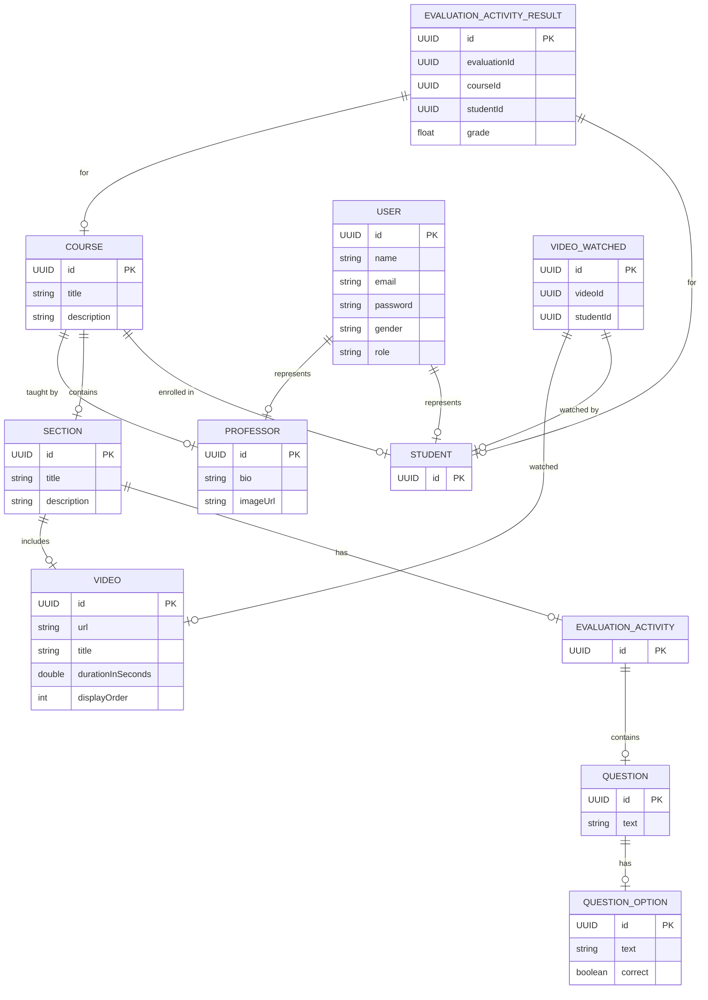

# EmpowerU API

## Overview

The EmpowerU API provides endpoints for managing videos, students, sections, professors, courses, evaluations, and certificates. This API is designed to support an educational platform, allowing for video management, student and professor operations, course enrollment, and more.

## Table of Contents
- [Overview](#overview)
- [Features](#features)
- [Technologies](#technologies)
- [Database Schema](#database-schema)
- [Setup](#setup)
- [Usage](#usage)
- [License](#license)
- [TODO](#todo)

## Features

- Manage videos: upload, update, delete, and mark as watched.
- Manage students: create, update, delete, and retrieve student information.
- Manage sections: create, update, delete, and retrieve sections by course.
- Manage professors: create, update, delete, and retrieve professor information.
- Manage courses: create, update, delete, and retrieve course details, as well as enroll and disenroll students.
- Evaluate activities: create and save evaluation results.
- Issue certificates for completed courses.
- Integrates with AWS SQS to handle asynchronous tasks, such as sending messages when a user is created.

## Technologies

- **Spring Boot** - Framework for building the REST API.
- **Spring Security** - For securing the application.
- **PostgreSQL** - Database for storing application data.
- **Azure Storage Blob** - For handling file uploads and storage.
- **JavaMailSender** - For sending emails.
- **Redis** - For caching.
- **AWS SQS** - For handling asynchronous messaging.
- **AWS Lambda** - For executing serverless functions, such as sending welcome emails and generating certificates.
- **Swagger** - API documentation.

## Database Schema

### Entity-Relationship Diagram



## Setup

### Prerequisites

- Java 17 or higher
- Maven 3.6.0 or higher
- PostgreSQL server
- Redis server
- AWS account with two SQS instances

### Installation

1. Clone the repository:

    ```bash
    git clone https://github.com/WiliamMelo01/EmpowerU-API.git
    cd EmpowerU-API
    ```

2. Update the `application-dev.properties` file with your database, email, and other configurations:

   ```properties
    # DATABASE CONFIGS
    spring.datasource.url=jdbc:postgresql://localhost:5432/empoweru
    spring.datasource.username=postgres
    spring.datasource.password=1234
    spring.datasource.driver-class-name=org.postgresql.Driver

    # HIBERNATE CONFIGS
    spring.jpa.properties.hibernate.dialect=org.hibernate.dialect.PostgreSQLDialect
    spring.jpa.hibernate.ddl-auto=update

    # FILE UPLOAD CONFIGS
    spring.servlet.multipart.enabled=true
    spring.servlet.multipart.max-file-size=200MB
    spring.servlet.multipart.max-request-size=300MB

    # AZURE STORAGE
    spring.cloud.azure.storage.blob.account-name=your-azure-blob-account-name
    spring.cloud.azure.storage.blob.endpoint=your-azure-blob-endpoint
    spring.cloud.azure.storage.blob.connection-string=your-azure-blob-connection-string

    # REDIS CONFIGS
    spring.cache.type=redis
    spring.data.redis.host=localhost
    spring.data.redis.port=6379
    spring.data.redis.password=12345

    # JWT CONFIGS
    jwt.secret=jwt-dev-secret

    # SERVER CONFIGS
    server.port=8080

    # AWS CONFIGS
    aws.accessKeyId=your_access_key
    aws.secretKey=your_secret_key
    aws.region=us-east-1
    aws.sqs.certificate-queue-name=yoursqsname
    aws.sqs.greetings-queue-name=yoursqsname
    ```

3. Ensure that the application is using the `dev` profile by setting the active profile in `application.properties`:

    ```properties
    # application.properties
    spring.profiles.active=dev
    ```

4. Build the project:

    ```bash
    mvn clean install
    ```

5. Run the application:

    ```bash
    mvn spring-boot:run
    ```

## Usage

- The API provides endpoints for managing videos, students, sections, professors, courses, evaluations, and certificates.
- For detailed information on available endpoints and their usage, refer to the Swagger documentation available at `/swagger-ui.html` once the application is running.

### User Creation and AWS SQS Integration

When a new user is created via the `/auth/public/register/student` or `/auth/public/register/professor` endpoints, a message is sent to an AWS SQS queue. This message can be consumed by another microservice for further processing, such as sending a welcome email. For more information on the microservice handling these messages, visit the [EmpowerU Greetings Microservice](https://github.com/WiliamMelo01/EmpoweruGreetingsMicroServiceLambda).

### Password Recovery

For handling password recovery requests, the EmpowerU Password Recovery Microservice is responsible for sending recovery codes and updating passwords. For more information, visit the [EmpowerU Password Recovery Microservice](https://github.com/WiliamMelo01/EmpowerUPasswordRecoveryMicroservice).

### Certificate Generation

The issuance of certificates for completed courses is handled by the EmpowerU Certificate Generation Microservice. This microservice generates certificates and sends them to students via email. For more details, visit the [EmpowerU Certificate Generation Microservice](https://github.com/WiliamMelo01/EmpoweruCertificateMicroserviceLambda).
